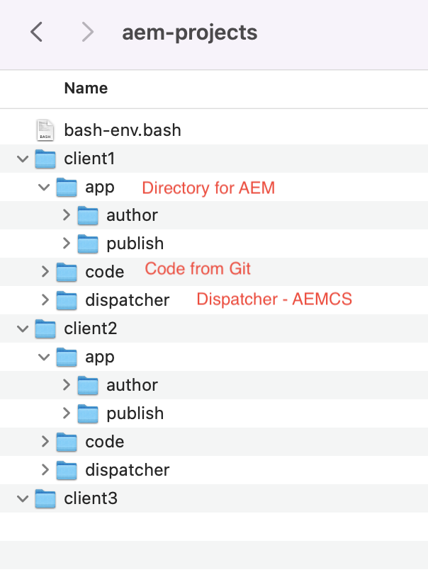

# 01 - Setting up Local Environment 
## Introduction
If you are like me, working on multiple AEM projects, for different clients.
You must be getting challenged with different laptops provided by the clients, some windows, some are OSX, some ubuntu.
I will introduce a simple way to setup your project structure which will provide you consistency, helpful short cuts and a repeatable process to add more projects.
I am using a Mac, but you can easily change the scripts for windows using the DOSKEY as a replacement for alias
Lets get started
## 01 - Directory Structure 
### High Level


### Exploded


## 02 - Debug File
copy start in crx-quickstart/bin to crx-quickstart/bin/start-debug and make the following change
Line 

`java $CQ_JVM_OPTS -jar $CURR_DIR/$CQ_JARFILE $START_OPTS &`

to

`java $CQ_JVM_OPTS $CQ_JVM_OPTS_DEBUG -jar $CURR_DIR/$CQ_JARFILE $START_OPTS &`


## 03 - Aliases - Unix
This step will create various aliases you can use to build and deploy project locally
```
#!/bin/bash

#define variables
PWD=`pwd`

export c1Home=$PWD/client1
export c1HomeCode=$c1Home/code
export c1HomeDispatcher=$c1Home/dispatcher/dispatcher-sdk-2.0.85
export c1HomeAuthor=$c1Home/app/author/crx-quickstart
export c1HomePublish=$c1Home/app/publish/crx-quickstart
export CQ_JVM_OPTS_DEBUG="-Xdebug -Xrunjdwp:transport=dt_socket,server=y,suspend=n,address=8765"
export CQ_JVM_OPTS_DEBUG_P="-Xdebug -Xrunjdwp:transport=dt_socket,server=y,suspend=n,address=8766"
export JAVA_HOME=/Library/Java/JavaVirtualMachines/jdk-11.0.11.jdk/Contents/Home

#Helper
alias c1="cd $c1Home"
alias c1aem="cd $c1HomeAuthor"
alias c1aemp="cd $c1HomePublish"
alias c1code="cd $c1HomeCode"
alias c1d="cd $c1HomeDispatcher"

#Author
alias c1start="$c1HomeAuthor/bin/start"
alias c1startdebug="$c1HomeAuthor/bin/start-debug"
alias c1stop="$c1HomeAuthor/bin/stop"
alias c1tail="tail -f $c1HomeAuthor/logs/error.log"

#publish
alias c1startp="$c1HomePublish/bin/start"
alias c1stopp="$c1HomePublish/bin/stop"
alias c1tailp="tail -f $c1HomePublish/logs/error.log"

alias c1clearlogs="rm -f $c1HomeAuthor/logs/*"
alias c1j="export JAVA_HOME=/Library/Java/JavaVirtualMachines/jdk-11.0.11.jdk/Contents/Home"

#Complete Installation Author Server
alias p="mvn clean install  -DskipTests -PautoInstallPackage,adobe-public"
#Core and Apps (Author Server)
alias pd="mvn -pl core -pl ui.apps clean install  -DskipTests -PautoInstallPackage,adobe-public"
#Core Apps and Config
alias pd="mvn -pl core -pl ui.apps -pl ui.config clean install  -DskipTests -PautoInstallPackage,adobe-public"
#Apps and Front End (Without the Core Bundle)
alias pdf="mvn -pl ui.apps -pl ui.frontend clean install  -DskipTests -PautoInstallPackage,adobe-public"

#Installation on Publish Server

alias pdp="mvn -pl core -pl ui.apps clean install  -DskipTests -PautoInstallPackagePublish,adobe-public"

#Complete Installation on Publish Server
alias pp="mvn  clean install  -DskipTests -PautoInstallPackagePublish,adobe-public"
```
[Download alias file](assets/01-bash-env.bash)
## 05 - Source aliases file
Open .bash_profile
```
source ~/code/aem-projects/bash-env.bash
```
## 06 - Aliases (Windows Users)
Windows users can use the `DOSKEY` command to install similar macros, and remember dos also has the && operator if you want to AND two or more commands.
All aliaes can be included into a .cmd file and can be invoked by simply typing `aem` (provided this cmd is in the windows path), name your file as `aem.cmd`
[Microsoft Reference](https://learn.microsoft.com/en-us/windows-server/administration/windows-commands/doskey)
### aem.cmd
``` 
REM Working on it 

```

## 07 - Demo
* Open a new terminal 

